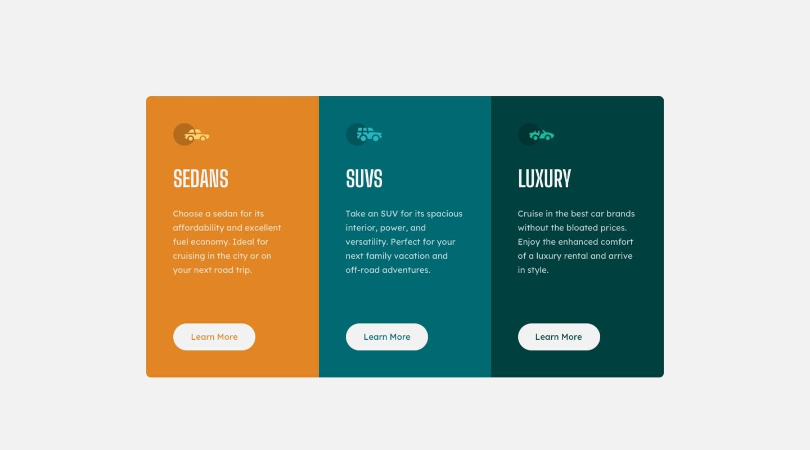
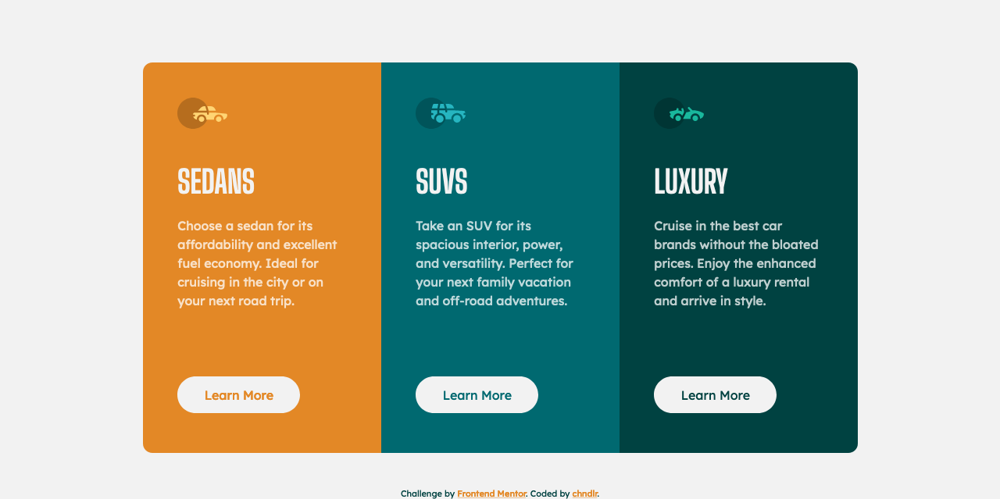

# Frontend Mentor - Profile card component solution

This is a solution to the [3-column preview card component challenge on Frontend Mentor](https://www.frontendmentor.io/challenges/3column-preview-card-component-pH92eAR2-). Frontend Mentor challenges help you improve your coding skills by building realistic projects. 

### The challenge

- Build out the project to the designs provided

### Screenshots

### Links

- [Live Site](https://3-column-card-component-seven.vercel.app/)

### Built with

- Semantic HTML5 markup
- BEM Methodology
- SCSS
- Flexbox
- Mobile-first workflow

