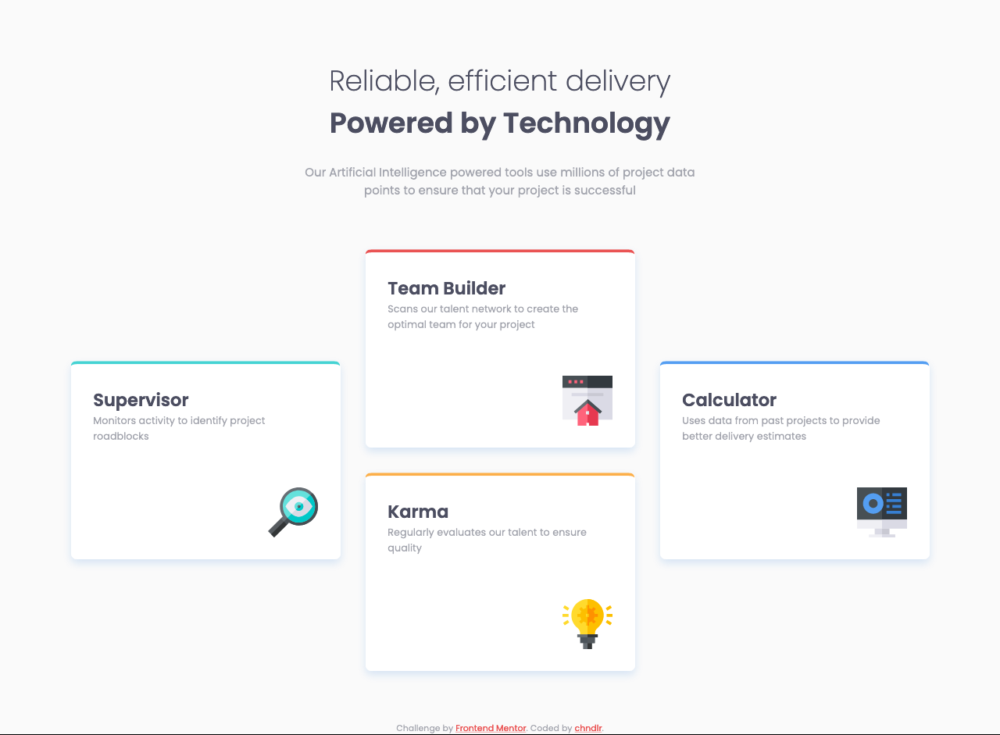

# Frontend Mentor - Four card feature section solution

This is a solution to the [Four card feature section challenge on Frontend Mentor](https://www.frontendmentor.io/challenges/four-card-feature-section-weK1eFYK). Frontend Mentor challenges help you improve your coding skills by building realistic projects.

### The challenge

- Build out the project to the designs provided

### Screenshots

### Links

- [Live Site](#)

### Built with

- Semantic HTML5 markup
- BEM Methodology
- SCSS
- Flexbox
- CSS Grid
- Mobile-first workflow
