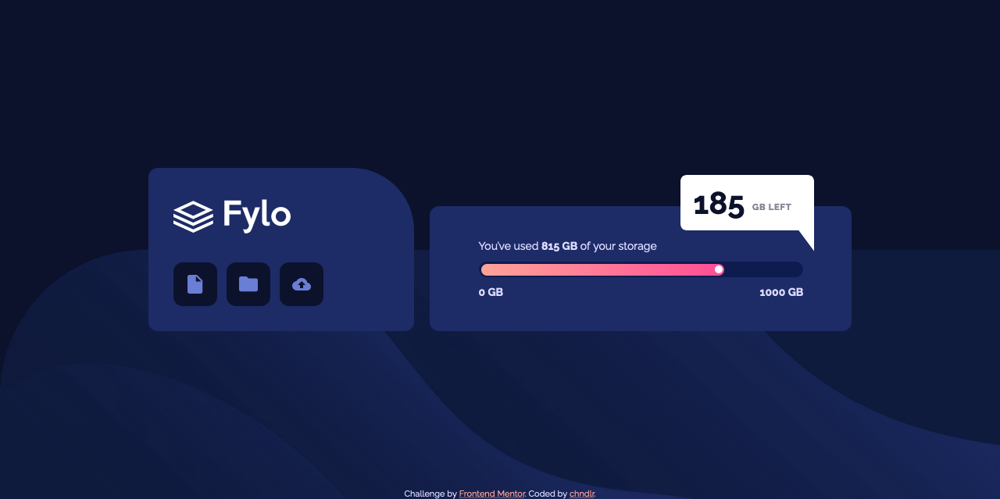

# Frontend Mentor - Fylo data storage component solution

This is a solution to the [Fylo data storage component challenge on Frontend Mentor](https://www.frontendmentor.io/challenges/fylo-data-storage-component-1dZPRbV5n). Frontend Mentor challenges help you improve your coding skills by building realistic projects.

### The challenge

Users should be able to:

- View the optimal layout for the site depending on their device's screen size

### Screenshots

### Links

- [Live Site](https://frontend-mentor-challenges-ten-psi.vercel.app/Fylo-Data-Storage-Component/index.html)

### Built with

- Semantic HTML5 markup
- BEM Methodology
- SCSS
- Flexbox
- Mobile-first workflow
