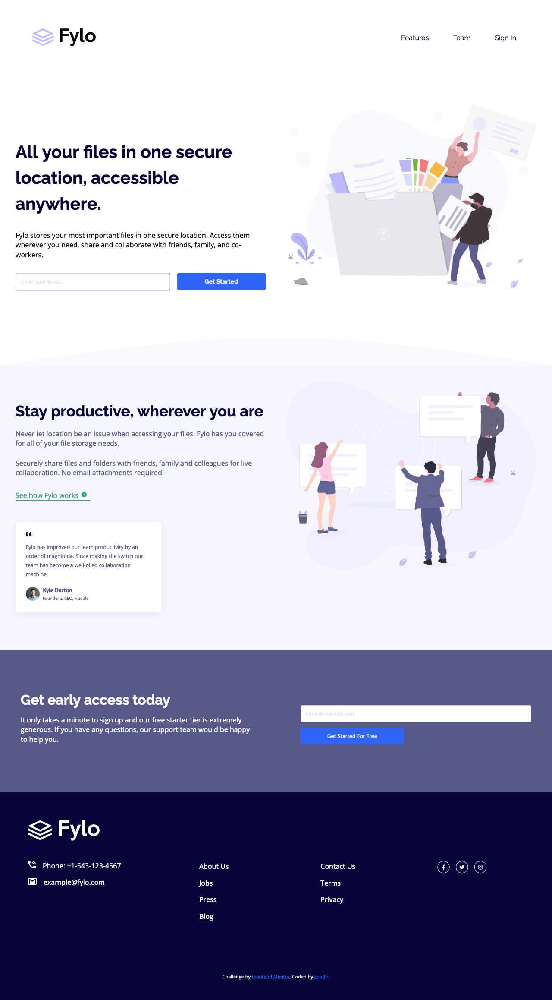

# Frontend Mentor - Fylo landing page with two column layout solution

This is a solution to the [Fylo landing page with two column layout challenge on Frontend Mentor](https://www.frontendmentor.io/challenges/fylo-landing-page-with-two-column-layout-5ca5ef041e82137ec91a50f5). Frontend Mentor challenges help you improve your coding skills by building realistic projects.

### The challenge

Users should be able to:

- View the optimal layout for the site depending on their device's screen size
- See hover states for all interactive elements on the page

### Screenshots

### Links

- [Live Site](https://frontend-mentor-challenges-ten-psi.vercel.app/Fylo-Landing-Page-With-Two-Column_Layout/index.html)

### Built with

- Semantic HTML5 markup
- BEM Methodology
- SCSS
- Flexbox
- CSS Grid
- Mobile-first workflow
