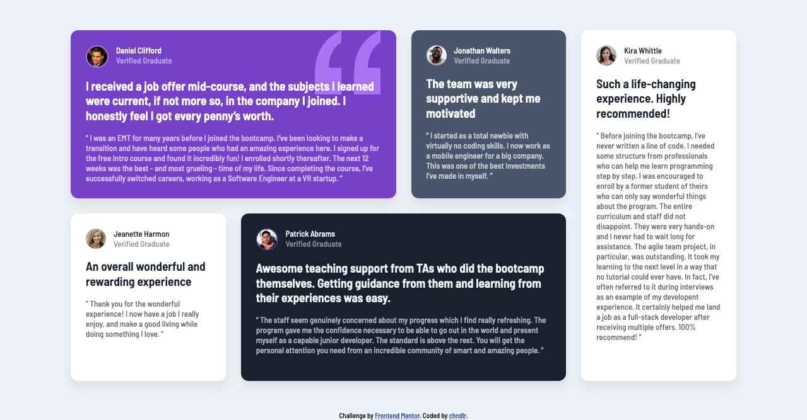

# Frontend Mentor - Testimonials grid section solution

This is a solution to the [Testimonials grid section challenge on Frontend Mentor](https://www.frontendmentor.io/challenges/testimonials-grid-section-Nnw6J7Un7). Frontend Mentor challenges help you improve your coding skills by building realistic projects.

### The challenge

Users should be able to:

- View the optimal layout for the site depending on their device's screen size

### Screenshots

### Links

- [Live Site](https://frontend-mentor-challenges-ten-psi.vercel.app/Testimonials-Grid-Section/index.html)

### Built with

- Semantic HTML5 markup
- BEM Methodology
- SCSS
- Flexbox
- CSS Grid
- Mobile-first workflow
